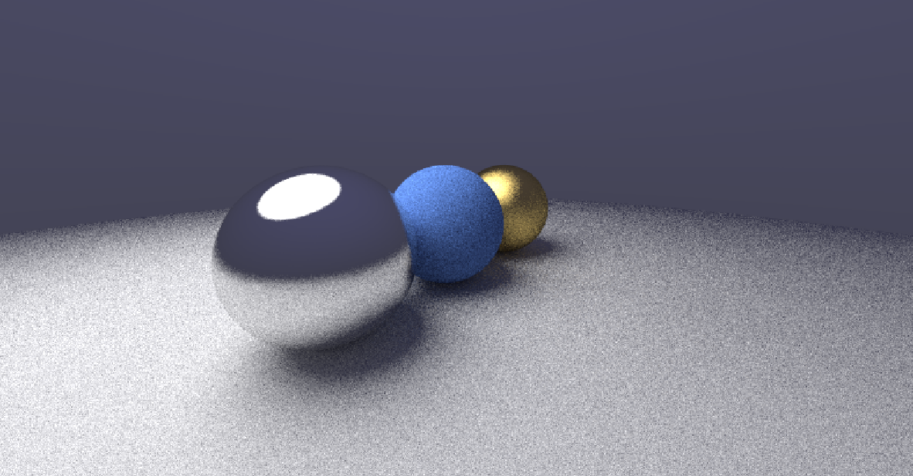

# Ray Tracer From Scratch

A high-performance, multi-threaded Ray Tracer built from the ground up in C++.
It implements **Path Tracing** logic to achieve photorealistic global illumination, soft shadows, and real-time progressive rendering using **OpenMP** and **Raylib**.


> *Rendered output showing global illumination, soft shadows, and material reflections.*

## ✨ Features
* **Path Tracing Engine:** Calculates true global illumination via Monte Carlo integration (recursive light bounces).
* **Multi-Threading:** Uses **OpenMP** to utilize 100% of available CPU cores for rendering.
* **Progressive Accumulation:** The viewport starts noisy for high-FPS interaction and progressively refines (denoises) the image when the camera stops.
* **Material System:**
    * **Lambertian:** Matte/diffuse surfaces (e.g., chalk, clay).
    * **Metal:** Reflective surfaces with adjustable roughness (fuzz).
    * **Emissive:** Light-emitting objects (e.g., the Sun).
* **Interactive Camera:** WASD + Mouse Look (FPS style control).

## 📂 Directory Structure

```text
Ray-Tracer-From-Scratch/
│
├── CMakeLists.txt           # Build configuration (CMake)
├── LICENSE                  # MIT License
├── README.md                # Project Documentation
├── .gitignore               # Git ignore rules
│
├── include/                 # Header files (Math & Physics engine)
│   ├── hittable.h           # Abstract base class for objects
│   ├── hittable_list.h      # List of hittable objects (the world)
│   ├── material.h           # Material definitions (Metal, Lambertian, Light)
│   ├── ray.h                # Ray class implementation
│   ├── rtweekend.h          # Constants and utility functions
│   ├── sphere.h             # Sphere object implementation
│   └── vec3.h               # Vector3 math library (dot, cross, unit_vector)
│
├── src/                     # Source files
│   └── main.cpp             # Main entry point, render loop, and scene setup
│
└── screenshots/             # Demo images
    └── render_highres.png

```

## 🛠️ How to Build & Run

### Prerequisites

* **C++ Compiler** (GCC/MinGW-w64 or MSVC) supporting C++17.
* **CMake** (3.11 or higher).
* **Git** (to clone the repo).

### Installation Steps

1. **Clone the repository:**
```bash
git clone [https://github.com/AkshitSingh7/Ray-Tracer-From-Scratch.git](https://github.com/AkshitSingh7/Ray-Tracer-From-Scratch.git)
cd Ray-Tracer-From-Scratch

```


2. **Create a build directory:**
```bash
mkdir build
cd build

```


3. **Configure and Compile:**
```bash
cmake ..
cmake --build .

```


*(Note: CMake will automatically download and link the **Raylib** dependency for you).*
4. **Run the Executable:**
* **Windows:** `.\Debug\raytracer.exe` (or just `raytracer.exe`)
* **Linux/Mac:** `./raytracer`


## 🎮 Controls

| Key | Action |
| --- | --- |
| **W / A / S / D** | Move Camera (Forward / Left / Back / Right) |
| **Space** | Fly Up |
| **Left Shift** | Fly Down |
| **Mouse** | Look Around |
| **Left Click** | **Lock Mouse Cursor** (Required to look around) |
| **Left Alt** | **Unlock Mouse Cursor** |
| **P** | Take Screenshot (Saved to project folder) |

## 📚 Technical Details

This project uses a **Monte Carlo Path Tracing** algorithm.

* **Rays per Pixel:** The engine fires rays randomly within each pixel (Anti-Aliasing).
* **Bounces:** Rays bounce up to **50 times** (Recursion depth) to calculate indirect lighting.
* **Accumulation Buffer:** When the camera is stationary, frames are averaged together to remove noise.
* **Gamma Correction:** Colors are square-rooted () before display to correct for monitor non-linearity.

## 🔗 Credits & License

* **Author:** Akshit Singh
* **License:** MIT License (See `LICENSE` file for details).
* **References:**
* *Ray Tracing in One Weekend* by Peter Shirley.
* Windowing provided by [Raylib](https://www.raylib.com/).


---

*Happy Rendering!*
